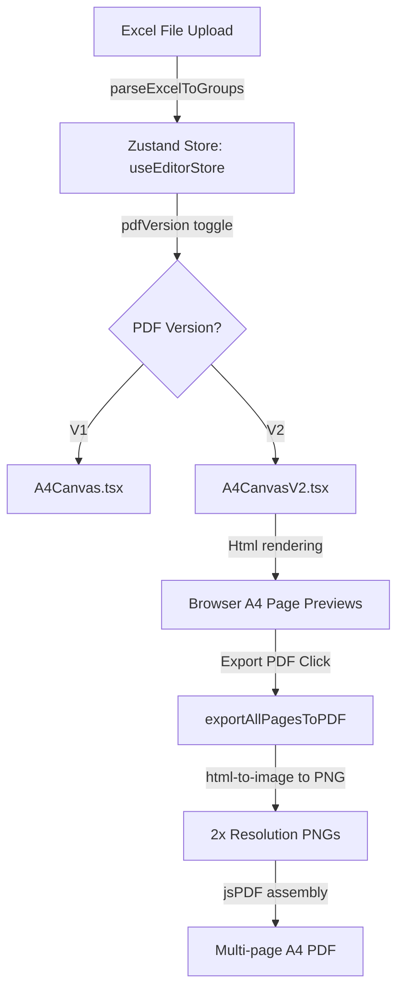

# KMUTT Project — Developer Documentation & Project Structure

Welcome to the KMUTT Infographics & CMS project. This document serves as a guide for new developers joining the team to understand the architecture, folder structure, and core workflows of the application.

---

## 1. High-Level Architecture

The project is built on **Next.js 14** (App Router) using **TypeScript** and **Tailwind CSS**. It contains features for admin dashboard management, survey results tracking, and an **Infographic CMS Builder** that parses admission data from Excel files and generates styled, print-ready multi-page PDFs or Word documents.

---

## 2. Directory Structure Map

Here is an overview of the key directories in the project workspace:

```text
kmutt-proj/
├── app/                      # Next.js App Router root
│   ├── (protected)/          # Protected routes requiring authentication
│   │   ├── admin/
│   │   │   └── infographic-builder/
│   │   │       └── page.tsx  # Main entry view of the Infographic CMS Builder
│   │   ├── dashboard/        # Admin dashboard views
│   │   └── survey/           # Survey management routes
│   ├── api/                  # Backend endpoints (Survey, Authentication, etc.)
│   ├── globals.css           # Global CSS and custom styles (THSarabun font configuration)
│   └── layout.tsx            # Global HTML wrapper and font providers
│
├── components/               # Reusable React components
│   ├── infographic/          # Components specifically for the Infographic CMS Builder
│   │   ├── A4Canvas.tsx      # Canvas layout for PDF V1 (General Infographic)
│   │   ├── A4CanvasV2.tsx    # Canvas layout for PDF V2 (Active Recruitment)
│   │   ├── FacultySummaryPageV2.tsx # Editable table listing admission limits (V2)
│   │   ├── FacultyCriteriaTablePageV2.tsx # Criteria grids for Engineering (V2)
│   │   ├── FacultyIntroPageV2.tsx   # Colorblindness rules & general criteria (V2)
│   │   ├── FacultyAdditionalPageV2.tsx # Portfolios and CEFR rules (V2)
│   │   ├── FacultyTOCv2.tsx  # Dynamic Table of Contents (V2)
│   │   ├── PageFooter.tsx    # Footer with dynamic page numbers and disclaimer
│   │   └── SidebarTools.tsx  # Sidebar for uploading files and tweaking settings
│   ├── survey/               # Components for surveys
│   └── ui/                   # Shared UI primitives (buttons, modals, tooltips)
│
├── lib/                      # Helper libraries, utilities, and parsers
│   ├── excelParser.ts        # Parses CRM export Excel sheets into AdmissionMajorGroup[]
│   ├── exportPdf.ts          # Uses html-to-image + jsPDF to render A4 elements to PDF
│   ├── exportDocx.ts         # Handles DOCX generation for admission criteria
│   ├── engineerReqData.ts    # Engineering requirement categories data
│   └── thsarabun-font-face.ts# Base64 embedding helper for THSarabun fonts in PDFs
│
├── stores/                   # Zustand global state stores
│   ├── useEditorStore.ts     # CMS state: parsed groups, active version, editable counts
│   └── auth.ts               # Authentication state
│
├── types/                    # TypeScript interfaces & types
│   ├── infographic.ts        # Types for CMS builder canvas, criteria, and elements
│   └── types.ts              # General domain types
│
└── resources/                # Example input files (Excel) and target reference PDFs
```

---

## 3. Core Workflow: Infographic CMS Builder

The Infographic Builder page allows administrators to upload a raw CRM Excel sheet, preview the parsed tables on A4 page canvases directly in the browser, customize text/images, and export them as PDFs.



### 3.1 Data Parsing (`excelParser.ts`)
*   Reads the first sheet of the uploaded file.
*   Maps column numbers to specific properties (e.g., Column 19 = `admissionMajor`, Column 20 = `faculty`, Column 28 = `limitApplicant`).
*   Resolves joint-media departments (`โครงการร่วมบริหารหลักสูตรมีเดียอาตส์และเทคโนโลยีมีเดีย`) into their own distinct faculty group to match target layouts.
*   Groups criteria rows by `(faculty, admissionMajor)` and returns an array of `AdmissionMajorGroup` to the Zustand store.

### 3.2 PDF Version Differences (V1 vs V2)
*   **V1 (Infographic):** Focuses on highly visual cards per major, suited for general web marketing.
*   **V2 (Active Recruitment PDF):** Designed for official admission publications. Matches the structured, page-numbered publication layout of the university:
    *   **Page 1:** Table of Contents.
    *   **Page 2:** Summary table of admission limits (supports manual "เดิม" count inputs in the UI and highlights updates).
    *   **Pages 3–8:** Engineering-specific requirements pages (Intro, Criteria tables, SAT/CEFR requirements).

---

## 4. PDF Generation Details (`exportPdf.ts`)

To bypass typical HTML-to-PDF font and sizing layout breakages, the app uses a **browser-native rendering screenshot approach**:
1.  It selects all target page elements (e.g. elements with `[data-a4-page-v2]` for V2).
2.  It applies a temporary class to hide visual distractions like box-shadows.
3.  It converts the HTML page wrapper to a high-resolution PNG using `html-to-image` at a `pixelRatio` of `2` to ensure crystal-clear text quality.
4.  It inserts the embedded **THSarabun** font styles inline during the capture to guarantee Thai characters render correctly.
5.  It pushes these PNGs page-by-page into a new `jsPDF` instance, rendering an exact A4-dimension PDF file.

---

## 5. Local Development Tips

*   **Temporary files:** All scripts and texts created during research are kept in the `/scratch` folder. This folder has been added to `.gitignore` so you don't commit temporary dumps.
*   **Tailwind Border overrides:** Tailwind CSS preflight defaults sometimes hide thin borders. In `FacultySummaryPageV2.tsx` and `FacultyCriteriaTablePageV2.tsx`, custom `<style>` blocks are injected to force solid black borders (`border: 1px solid #000 !important`) for printable tables.
